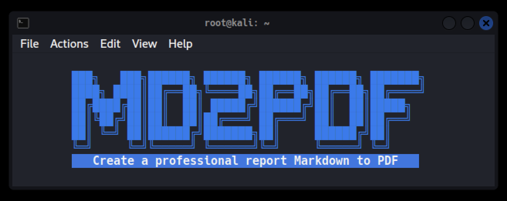

# MD2PDF
[](#)
[](#)
[](#)
[](#)
[](#)
[](#)



Script en Bash para facilitar el crear un reporte profesional de un archivo con formato Markdown a un archivo PDF, con opción a comprimirlo en un archivo 7-zip con password.

El script fue inspirado para poder realizar de forma más eficiente, limpio, profesional y rápido un reporte para las certificaciones de Seguridad informática de Offensive Security como la OSCP, OSWE, OSCE, OSEE, OSWP.

El script se basa en la plantilla de [Eisvogel](https://github.com/Wandmalfarbe/pandoc-latex-template), una plantilla limpia de pandoc LaTeX para convertir sus archivos de Markdown a PDF. La plantilla es compatible con pandoc 2.

Ejemplos:

**OSCP whoisflynn improved template v3.2**


## Requerimientos
+ LaTeX - (`apt install texlive`)
+ LaTeX-extra - (`apt install texlive-latex-extra`)
+ LaTeX-fonts-extra - (`apt install texlive-fonts-extra`)

## Instalación
```bash
wget https://raw.githubusercontent.com/m4lal0/md2pdf/main/md2pdf.sh
chmod +x md2pdf.sh && mv md2pdf.sh /usr/local/bin/md2pdf
```

## Configuración del reporte

Para tener buenos encabezados y pies de página, debe proporcionar metadatos a su documento. Puede hacerlo con un bloque de metadatos YAML en la parte superior de su documento de markdown (consulte el archivo de [markdown de ejemplo](examples/OSCP-exam-report-template_whoisflynn_v3.2.md)). Su documento de markdown puede tener el siguiente aspecto:

``` markdown
---
title: "Offensive Security Certified Professional Exam Report"
author: ["student@youremailaddress.com", "OSID: XXXX"]
date: "2020-07-25"
subject: "Markdown"
keywords: [Markdown, Example]
subtitle: "OSCP Exam Report"
lang: "en"
titlepage: true
titlepage-color: "1E90FF"
titlepage-text-color: "FFFAFA"
titlepage-rule-color: "FFFAFA"
titlepage-rule-height: 2
book: true
classoption: oneside
code-block-font-size: \scriptsize
---

Here is the actual document text...
```

## Paleta de Colores

Los conjuntos de colores que se pueden utilizar en la plantilla YAML frontmatter:

titlepage-color          | titlepage-text-color | titlepage-rule-color
-------------------------|----------------------|---------------------
`DC143C` (Crimson)       | `FFFFFF` (White)     | `FFFFFF` (White)
`00FF7F` (SpringGreen)   | `006400` DarkGreen   | `000000` (Black)
`1E90FF` (DodgerBlue)    | `FFFAFA` (Snow)      | `FFFAFA` (Snow)
`483D8B` (DarkSlateBlue) | `FFFAFA` (Snow)      | `FFFAFA` (Snow)
`FFD700` (Gold)          | `000000` (Black)     | `000000` (Black)
`FFEFD5` (PapayaWhip)    | `000000` (Black)     | `000000` (Black)
`FF8C00` (DarkOrange)    | `000000` (Black)     | `000000` (Black)
`FFEF96` (no name)       | `50394C` (no name)   | `50394C` (no name)


## Uso

Escribir su reporte en **Markdown**.

Ejecutar el script y pasar como primer argumento el archivo markdown y como segundo argumento proporcionar el nombre del reporte con extensión PDF que queremos que transforme:
```bash
md2pdf <input.md> <output.pdf>
```

El script verificará primero unos requerimientos previos (Pandoc y plantilla Eisvogel), si no cuenta con ellos los instalará automáticamente.
Una vez realizado lo anterior creará el reporte en PDF, y nos preguntará si queremos comprimirlo en un archivo 7-zip con un password.